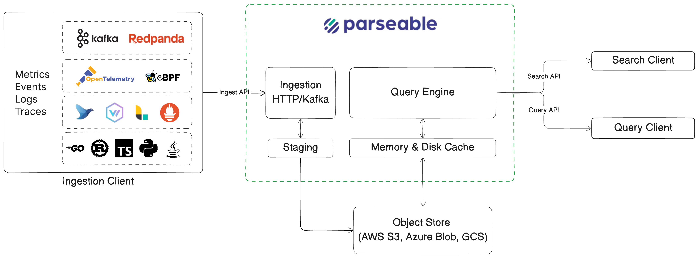

# Introduction

Parseable combines a purpose built OLAP, diskless database [Parseable DB](https://github.com/parseablehq/parseable) and Prism UI. These components are designed from first principles to work together, enabling efficient and fast ingestion, search, and correlation of MELT (Metrics, Events, Logs, and Traces) data.

## Differentiators
### Resource Efficiency
- Parseable consumes 50% less CPU and 80% less memory than traditional JVM-based solutions like Elasticsearch under similar workloads. 
- Built-in compression to compress observability and telemetry data by up to 90%. 

### Performance
- With Rust based design, modern query techniques, and intelligent caching on SSDs / NVMe and memory, Parseable offers extremely fast query experience for end users.

### Flexible Data Handling
- Ingest logs, metrics, and traces in OpenTelemetry format, supporting structured and unstructured data. It employs an index-free approach, enabling high throughput ingestion with low latency for queries.

### Easy Setup & Deploy Anywhere Securely
- Supports deployment across public or private clouds, containers, VMs, or bare metal environments with complete data ownership, data security and privacy. Single binary with a built-in UI (PRISM) allows setup within minutes.

### Cost-Effective
- Efficient compute utilization, compression and utilizing object storage like S3 offers up to 70% cost reduction compared to Elasticsearch or up to 90% compared to DataDog.

:::info
Want to use a LLM to ask questions on Parseable docs? Copy the docs text from http://parseable.com/llms.txt and paste into the LLM.
:::
